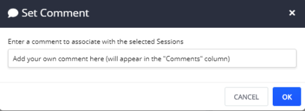
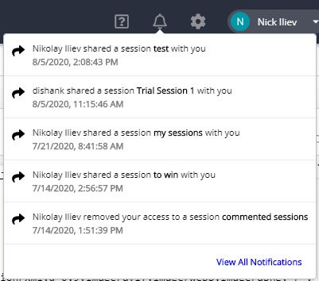

## Fiddler Everywhere Collaboration

The Fiddler Everywhere client provides easy and secure sharing of network debugging logs within your teams for quick analysis, communication, and resolution. 

In previous versions of Fiddler Everywhere, collaboration was limited to exporting .saz files and emailing back and forth. Now, all sharing and commenting happen directly within the Fiddler Everywhere UI, providing a much more comfortable and secure manner of collaborating with your team.

## Save and Share Sessions

Network sessions captured by the Fiddler Everywhere client can be saved into workspaces and replayed later. These same sessions can also be shared with your teammates! Simply use the sharing features of Fiddler Everywhere and invite other team members to collaborate.

Save and share a session with a collaborator while following these steps:
 1. Capture the traffic (that you would like to share with your collaborators).
 2. Use a preferred way to save and share a session. With Fiddler Everywhere, you can share captured traffic via:
    - [Live Traffic toolbar](#live-traffic-toolbar) provides **Save** and **Share** options.
    - [Live Traffic list](#live-traffic-list) provides **Save** and **Share** options via the context menu.
    - [Sessions list]() provides **Share** functionality via dedicated button.
    - [File menu]() allows you to import/export different known formats (like HTTPArchive, Packet Capture, Folder Tree, and others) and to load and save Fiddler archives (SAZ format).

>tip The Fiddler Everywhere free version has a quota for sharing sessions with collaborators. Check [the advantages provided by Fiddler Everywhere Pro](#fiddler-everywhere-pro), which significantly extends the collaboration quotas.

## Add Context for Teammates

Some network sessions can be missing important context that is not captured in the technical details. Fiddler Everywhere allows you to add meaning to sessions by adding comments. Your peers as well can add information to the same comment thread for full communication and collaboration.

The Fiddler Everywhere client allows you to add comments and description in the following ways:
- Add a custom comment to one or more captured sessions. To add a comment, use the **Comment** option from the context menu or press **M** while having the desired courses selected.

    

- Add a custom description while sharing a session or several sessions. To add a description, use the **Share** option (from the **Live Traffic toolbar** or from the **share** button in the **Sessions** list) and provide the additional information as a note. The note will be received as a context in the email received from the recipients (the collaborator's emails).

    

## Notifications for Shared Content

The Fiddler Everywhere client informs the collaborators for shared sessions in two channels:
- The collaborators will receive an email with an invitation to open the shared sessions. In case the creator has added note, the email will contain the note as well.
- All listed collaborators will receive a notification within the Fiddler Everywhere client. You can click on the notification to immediately open the share sessions in a separate tab.

    