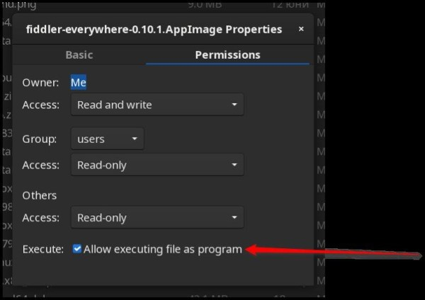
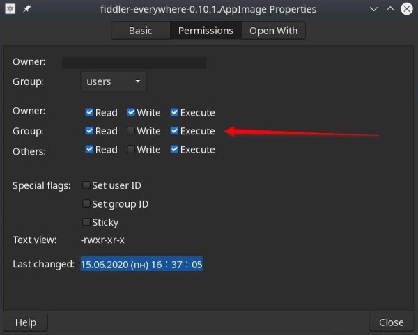

## Installation 
 
Steps to install Fiddler Everywhere client on your system: 

1. The Fiddler Everywhere installer is available for download on the [Progress website](https://www.telerik.com/download/fiddler-everywhere).

2. Click **Download for <Your-OS-here>** to start downloading the installer for the respective operating system. The default operating system option is determined based on the currently used system.

3. Run the **Fiddler Everywhere** executable file to start the installation process. For Linux, you might need to explicitly [set the file as executible](#linux-installation).

4. Create and login with your Fiddler credentials or use Google authentication login.

    

5. Fiddler Everywhere is ready to be used.

>tip By default, the standard installation will allow you to track only non-secure HTTP traffic. To enable tracking and decoding of HTTPS, you will need to install a trusted certificate, as shown in the [HTTPS]() article.

### Linux Installation

On most **Linux** distributions before the installation can be started, the user needs to set the installation file as executable. This can be achieved via command line or via the GUI

- **Command line instructions**

    - Open a terminal
    - Navigate to the folder where the installation file resides.
    - Type `sudo chmod +x filename.appimage`. You can omit the `sudo` command if the currently logged user is the one that downloaded the executable.
    - Enter your username and password (if prompted) and press **Enter**.
    - Once the installation file is set as executable, you can [continue the installation process](#installation).

- **GUI Instructions**

    Alternatively, many Linux distributions are providing options to set the file executable rights via the used GUI.

    **Gnome**

    

    **Cinnamon**

    

    **KDE**

    

## Update

Steps to update Fiddler Everywhere to the latest version:

1. Start __Fiddler Everywhere__.

2. From the main menu, choose _Help_ > _Check for Update_. If a newer version is available, a notification will ask for your agreement to download and install it.

3. Fiddler Everywhere will restart and automatically update to the latest version.