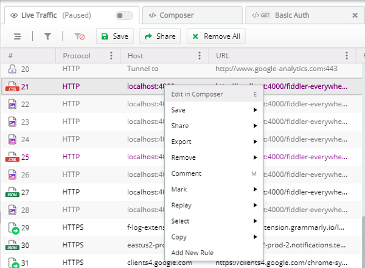
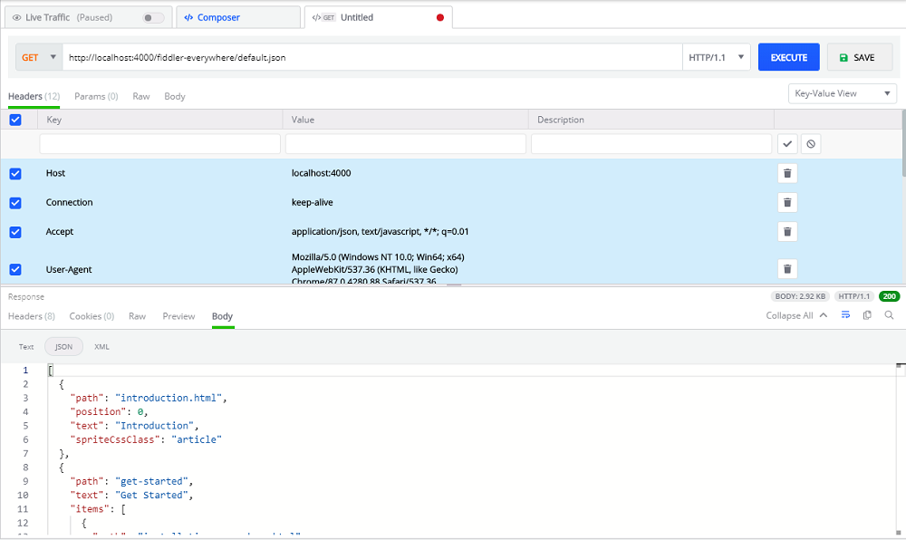

# Modify Traffic

Editing traffic with Fiddler Everywhere client is one of the easiest and yet most powerful debugging techniques. Instead of trying to test your API or a website via the UI and make multiple clicks, you can reload the desired session in the [**Composer**](), make edits to the desired values, and re-execute the request.

Follow these steps, to load and modify a session via the **Composer**:

1. Set **Live Traffic** to _Capturing_ and make the request. The session is captured and displayed in the **Live Traffic list**. 

2. Select the desired session and make a right-click to open the context menu. From the context menu, select **Edit in Composer**. Alternatively, select the session and use the keyboard shortcut by pressing key **E**.

    

3. Change the desired values. For example, change the data payload, modify the headers, test the authentication, etc.

    

    >tip To modify a header, select it and change the needed key-value pair. You can add a new header using the top key-value row (which is empty by default and ready to receive new values). Once the modifying or adding new header is done, press the confirmation button (a tick) to the right to apply the changes.

4. Click **Execute**.

Effectively, you have modified an existing request the same way your application would. In the [**Live Traffic list**]({slug web-sessions-list}#live-traffic-list), you can find the newly executed request and the response from the server.

## Additional Resources

- [Create an API request via the Composer]()
- [Mock server response]() 
- Share snapshots of sessions with collaborators.

