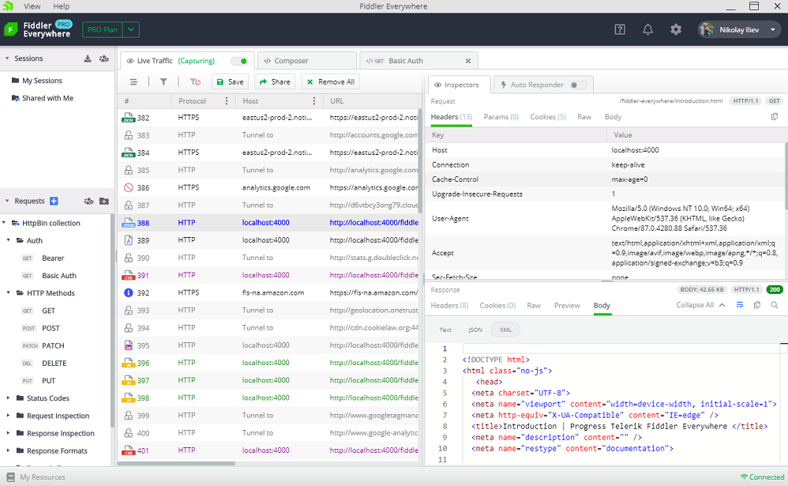

## Welcome to Fiddler Everywhere!

Thank you for choosing [**Fiddler Everywhere**](https://www.telerik.com/fiddler-everywhere) web debugging proxy. The client can be installed on Windows, Linux, and macOS systems and supports a multitude of browsers and programs. Locally-running programs like web browsers, MS Office applications, and other clients send their HTTP and HTTPS requests to Fiddler Everywhere, which then forwards the traffic to a web server. Then, the server’s responses are returned to Fiddler Everywhere, which passes the traffic back to the client. Fiddler Everywhere can display and modify the encrypted requests by decrypting the HTTPS traffic using a man-in-the-middle technique.  

## Features

- Compatible with MacOS, Windows, and Linux.
- Electron-based UI with intuitive design. 
- Capture web traffic (HTTP & HTTPS).
- Decrypt secure traffic (HTTPS).
- Inspect captured sessions.
- Save, share, and receive snapshots of captured traffic with collaborators.
- Compose and inspect requests.
- Save composed requests in collections.
- Advanced features to modify and debug traffic via AutoResponder.
- In-app interactive tutorials.
- Online feedback portal and documentation.
- [Fiddler Everywhere Pro](#fiddler-everywhere-pro) features with extended sharing and collaboration options.

## Fiddler Everywhere Pro

All Fiddler Everywhere features are available in both the **Free** and the **Pro** version. However, the **Fiddler Everywhere Pro** version dramatically extends the free version's sharing and collaboration options. The free version has some limitations related to sharing quotas. Refer to the table below for a detailed comparison of the Free versus Pro versions.

| __Features__ |  __Free__ | __Pro__ |
|---|---|---|
| Capture and Inspect Traffic | **Unlimited** | **Unlimited** |
| Creating Composer Requests | **Unlimited** | **Unlimited** |
| Using Auto Responder Rules | Up to 2 rules simultaneously | **Unlimited** |
| Creating Saved Sessions Snapshots * | Up to 5 sessions | **Unlimited** |
| Sharing Saved Session Snapshots | Up to 5 snapshot (with up to one user) | 500 sessions/month  |
| Shared Snapshots Size | Max 5 MB | Max 50 MB |

>tip A **Snapshot** in Fiddler Everywhere is a term that describes an entry that holds single or multiple sessions (captured traffic). Saved snapshot entries are listed in [the **Sessions** list]() and can also be exported as [**SAZ** archive]().

## Installation

Download the [latest Fiddler Everywhere](https://www.telerik.com/download/fiddler-everywhere).
To learn how to install Fiddler Everywhere, visit the [Installation]() section.

## Documentation

[Official Fiddler Everywhere documentation](https://docs.telerik.com/fiddler-everywhere/introduction?_ga=2.206480400.2086505781.1591948423-772467175.1590489532)

We believe documentation is at its best when the content is a product of collaboration between the builders and consumers of that product. Everybody can play a role in making our documentation better, and we encourage you to help us with that task in the way that you choose:

- Send Feedback
    Use the __Was this article helpful?__ functionality to give us feedback and ideas on how we can improve the documentation. Alternatively, you could request a feture or report a bug using the [Fiddler Everywhere Feedback Portal](https://feedback.telerik.com/fiddler-everywhere).

- Create an Issue
    If you find an issue with our docs that needs addressing, the best way to let us know is by creating an issue in our [Github repository](https://github.com/telerik/fiddler-everywhere-docs). When creating an issue, please provide a descriptive title, be as specific as possible, and link to the documentation article in question. If you can provide a link to the closest anchor to the issue, that is even better.

- Send a Pull Request
    Creating an issue is great, but what we love are pull requests. So, if you find an issue in the docs, or even feel like creating new content, we’d be happy to have your contributions! 

    In order to do this, you must fork our documentation and submit a pull request. That way, you may contribute an update exactly where you found the error. After that, our technical writing team will need to approve your change request. Please use only standard markdown. For more detailed instructions, please follow the [contribution instructions](https://github.com/telerik/fiddler-everywhere-docs#contributing) published in GitHub. You could directly initiate a pull request by using the __Improve this article__ functionality.

## License

Licensing agreement and detailed information about the different licenses and which one you should acquire is available in the [Licensing](https://www.telerik.com/purchase/license-agreement/fiddler-everywhere-beta) section.

