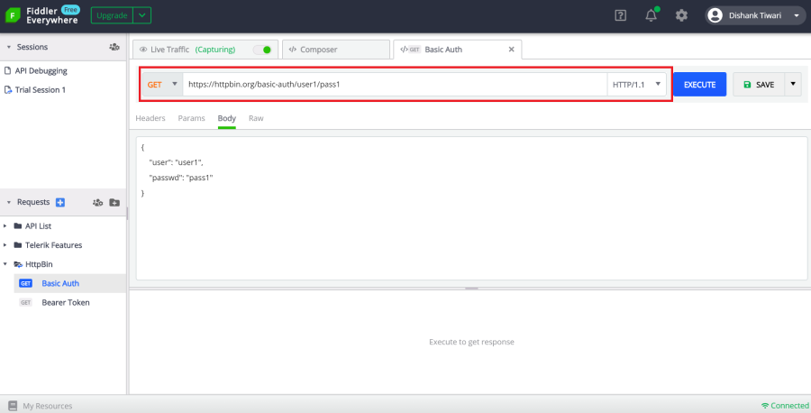
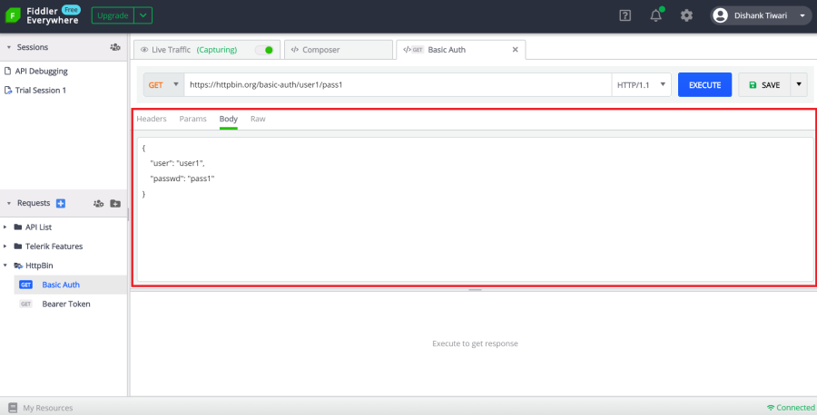
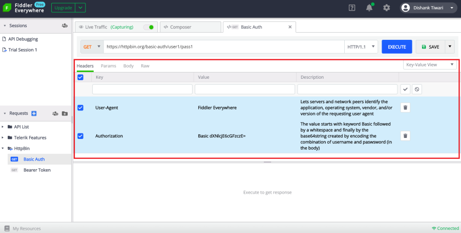
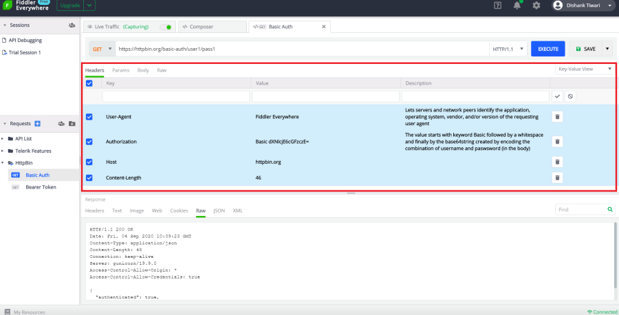

## Environment

<table>
	<tbody>
		<tr>
			<td>Product Version</td>
			<td>1.0.1</td>
		</tr>
		<tr>
			<td>Product</td>
			<td>Fiddler Everywhere</td>
		</tr>
	</tbody>
</table>

## Description

Fiddler Everywhere certificate allows the inspection and debugging of network traffic. The __Composer__ feature in Fiddler Everywhere enables you to manually build and send HTTP or HTTPS requests. Click [here]() to know more about Fiddler Everywhere Composer.

In the context of an HTTP transaction, __Basic Access Authentication__ is a method for an HTTP user agent (for example, a web browser) to provide a user name and password when making a request. In __Basic HTTP Authentication__, a request contains a header field in the form of Authorization: Basic <credentials>, where credentials are the __Base64__ encoding of `ID` and `password` joined by a single colon(`:`).

Now, let's see how you can create a Composer request for APIs that require authentication:

>tip In the steps shown below, you can use [httpbin.org](https://httpbin.org/) for HTTP request and response service.

## Step 1

Set the HTTP/HTTPS method to __GET__ and add the URL in the URL field. The added URL has been generated from the [httpbin.org](https://httpbin.org/).

In the above image, as you can see the specified URL is [https://httpbin.org/basic-auth/user1/pass1](https://httpbin.org/basic-auth/user1/pass1). Here __basic-auth__ determines that the Authentication taking place is Basic. The next two fields __user1__ and __pass1__ are the values of `user` and `passwd` variables, respectively.

## Step 2

Create an object inside the __Body__ tab. The predefined variables for the basic authentication are `user` and `passwd`. Set the values for both variables.

In the above image, the values of the `user` and `passwd` variables are __user1__ and __pass1__, respectively.

## Step 3

Once you create the object in the __Body__, go to the __Headers__ tab, where you can see a predefined key `User-Agent` added from Fiddler Everywhere. Now, let's add the Authorization key to the header. For that:

- Encode the values of the variables set in the JSON format. Encode the texts with simple __Base64 converters__. The format of the text should be `<username>:<password>`. The encoded value of __user1:pass1__ is `dXNlcjFwYXNzMQ==`.

- In __Headers__ tab:
    - Set the __Key__ to `Authorization`.
    - Set the __Value__ to `Basic dXNlcjFwYXNzMQ==`.
    - Add a __Description__ for the key. Click the __tick__.

A key named `Authorization` has been added to the __Headers__ tab.

After executing all the above steps, click __Execute__ (placed at the right side of the URL field).

Clicking the __Execute__ button will add two more Keys to the __Headers__ tab named `Host` and `Content-Length`.

Following the above steps will create Basic Authentication with Fiddler Everywhere. To check, go through the __Response Inspector__ section of the Composer. A successful request should return __status 200__ from the server along with the server-specific payload.

Refer to the image below:

The above response is HTTPBin specific as we used it to create the Basic Authentication. 