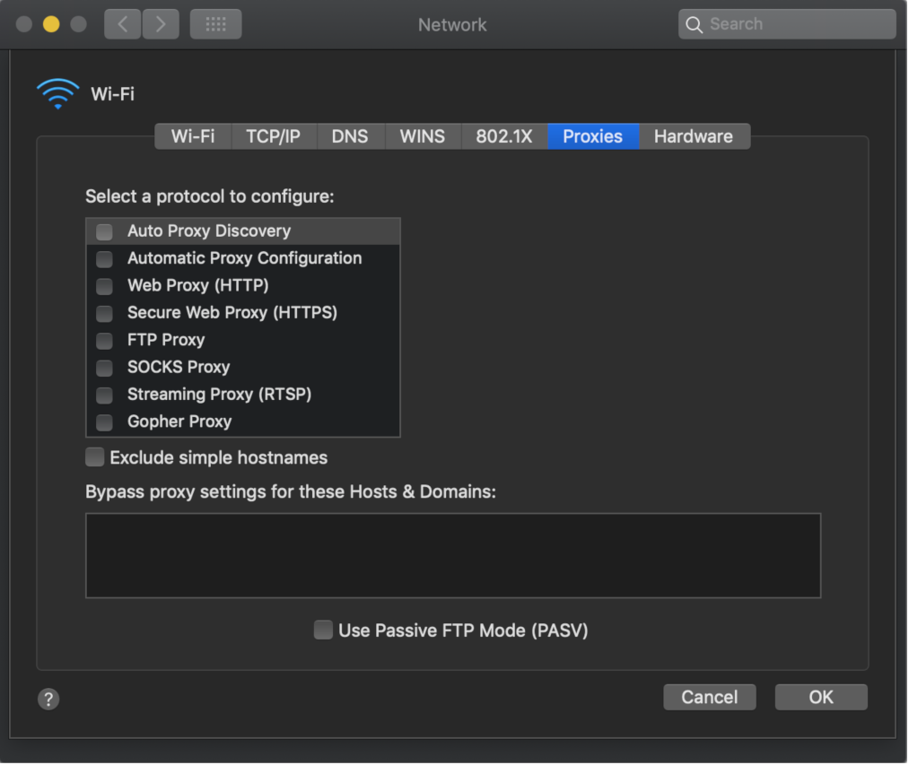
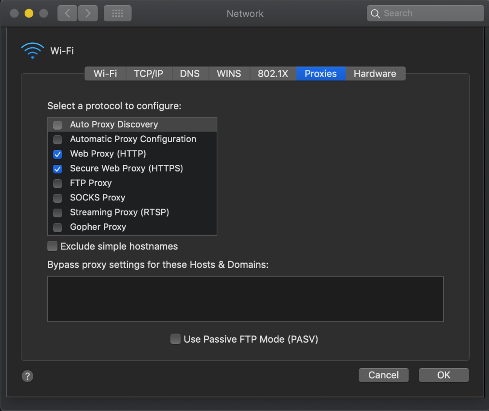

## Environment
<table>
	<tbody>
		<tr>
			<td>Product Version</td>
			<td>0.5.0</td>
		</tr>
		<tr>
			<td>Product</td>
			<td>Fiddler Everywhere</td>
		</tr>
	</tbody>
</table>

## Description
In order to troubleshoot common Mac scenarios, it is important to verify the Mac proxy settings.

For example, after [Installing Fiddler Everywhere on a Mac](https://docs.telerik.com/fiddler-everywhere/getting-started/installation), some users have reported that Fiddler Everywhere doesn't capture which can be caused from many different reasons.

In order to troubleshoot this, it is recommended perform the following steps.

1. [Reset the Fiddler Everywhere Settings to the default values](how-to-reset-fiddler-everywhere-settings-to-default)
1. Close Fiddler Everywhere
1. [Verify the Mac Proxy Settings](#verify-mac-proxy-settings-are-changed-on-startup)
1. Open Fiddler Everywhere
1. [Verify the Mac Proxy Settings](#verify-mac-proxy-settings-are-changed-on-startup)

### Verifying Mac Proxy Settings are Changed on Startup

Apple Mac Proxy Settings can be found in **System Preferences** -> **Network** -> **Advanced**.

**NOTE:** Each Network Adapter will have Proxy Settings. For example, if internet is available through an Ethernet Port and a WiFi Connection there will be two adapters each with separate Proxy Settings.

The Fiddler Everywhere default settings will **Act as a System Proxy on Startup**.

#### Apple Mac Proxy Settings 

When Fiddler Everywhere is closed with the default settings, the System Proxy Settings will look like the following.

When Fiddler Everywhere is open with the default settings, the System Proxy Settings will look like the following.

