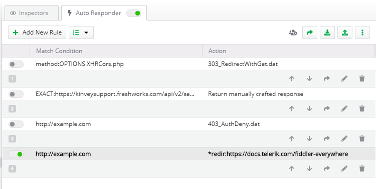

# Auto Responder

The __Auto Responder__ is one of the most powerful features of Fiddler Everywhere. It enables you to create __rules__ that will automatically trigger in response to requests. The functionality provides means to easily and quickly test changes to web code without updating the production server, to reproduce previously captured bugs (in SAZ files), or to run website demos while being entirely offline.

1. Click the __Auto Responder__ button

1. The two main tabs (__Rule Editor__ and __Queue Rules Viewer__) of __Auto Responder__ are shown

- The __Rule Editor__ tab allows you to create new rules and edit existing ones. See details on how to use the editor in the [__Rule Editor__ article]()

- The __Queue Rules Viewer__ list the currently used rules and provides additional control over them. The tab also exposes options to import/export rules files (__FARX__), to change the priority of the rules (of execution) and to entirely enable/disable the __Auto Responder__ or specific rules. See details on how to use the editor in the [__Queue Rules Viewer__ article]()

>tip You need o enable Live Traffic to _Capturing_ to be able to apply auto responder rules.

