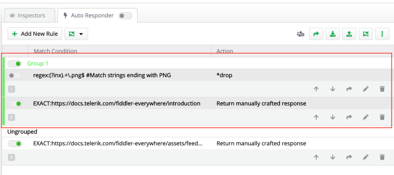
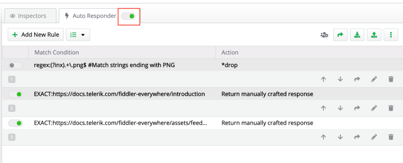

## Queue Viewer

The __Queue Viewer__ (a.k.a. __Queue Rules Viewer__) interface is a queue of the created auto responder rules. The __Queue Viewer__ allows the listed rules to be enabled and disabled, to be promoted and demoted (by changing their queue position), to be edited, to be exported and imported. The option to enable the __Auto Responder__ and to allow a non-matching request to pass-through is also part of the __Queue Viewer__.

## Rules Grouping & Priority

By default, the __Queue Viewer__ will list all created & imported rules based on their priority (see [Rule Options](#rule-options) for details on how to promote/demote a rule in the queue). You can also create a custom group for the rules in the queue by using __Group View/Priority View__ toggle button. 

Use __Group View/Priority View__ toggle to switch the rules in the queue based on priority vs. group identity.

Use __Group/Ungroup__ toggle button to create croups for selected rules in the queue. Note that the __Group/Ungroup__ button is visible only when you have toggled to __Group View__.

## Enable Auto Responses

Use the __Enable Auto Responses__ checkbox to activate the __Auto Responder__. Note that __Live Traffic__ switch should also be turned on to _Capturing_ mode.

## Import Rules

You can import rules from a __FARX__ (Fiddler Auto Responder XML) file. The __FARX__ file contains a set of previously created Auto Responder rules. Your current set of rules is automatically saved on exit and reloaded when you start Fiddler Everywhere again.

Use the __Import__ button to provide a FARX file that contains the set of rules.

## Export Rules

You can export rules in a FARX file (Fiddler Auto Responder XML). The exported file can be easily reused via the [import functionality](#import-rules).

Use the __Export__ button to create a FARX file that contains the set of rules.

## Unmatched Requests Passthrough

The __Unmatched Requests Passthrough__ option controls what happens when a Session does not match any of the applied rules. When the checkbox is checked, the unmatched requests are sent to the server normally, without any interference from the Auto Responder. When the option is OFF (the checkbox is unchecked), Fiddler will generate a __404__ Not FOund response for any _unconditional_ requests that are not matching the applied rules.

>important By default, when the __Auto Responder__ is enabled, the __Unmatch Requests Passthrough__ option is turned off, meaning that all unmatched requests will start to fail with a __404 (Fiddled)__ response.

For example, Fiddler generated a 404 response due to a request that is not matching the applied rules when __Unmatch Requests Passthrough__ option is turned off.

## Rule Options

Each rule present in the __Queue Viewer__ can be controlled via the following options:

- __Enable & Disable Rule__  - Sets if the specified rule will be applied or not.

- __Promote__ - Raises the priority of the specified rule in the queue. If the rule has applied a final action, the lower priority rules won't be applied.

- __Demote__ - Lowers the priority of the specified rule in the queue.

- __Edit__ - Opens the specified rule in the [__Rules Editor__]() where it can be edited and saved.

- __Delete__ - Deletes the specified rule permanently.

