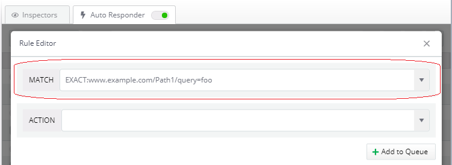
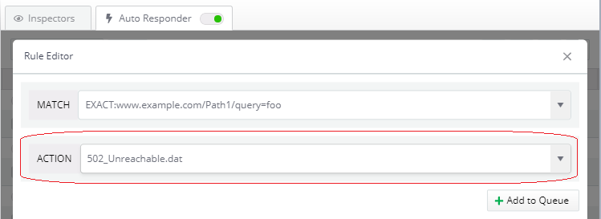

# Rules Editor

The __Rules Editor__ interface enables creating and editing rules. You need to enter a __match rule__ and an __action string__, and Fiddler Everywhere will undertake the action if the request URI matches the __match rule__.


## Create New Rule

1. Click on __Create New Rule__ button in the __Rules Editor__.

2. Enter a __match rule__. See the [match rule section](#match-rules) for more details.

3. Enter an __action string__. See the [action string section](#action-strings) for more details.

4. Add the newly created rule to the __Queue Viewer__ list of rules.

Tips:
- Rules are applied in the order that they appear in the __Queue Viewer__. Hit the __Down Arrow__ to demote a rule.
- You can export the current queue of rules [via the __Export__ button](#export-rules) from the __Queue Viewer__ toolbar.
- You can import a __*.FARX__ file [via the __Import__ button](#import-rules) to queue rules based on previously captured traffic.


## Match Rules

Fiddler Everywhere will accept string literals, regular expressions, and a set of some special match rules as listed below.

### String Literals

- __String Literals__ - Will match string literals (case insensitively).
- __\*__ - Will match everything.
- __EXAMPLE__ - Will match URLs of type _http://www.**EXAMPLE**.com/somePath_
- __path1/__ - Will match URLs of type _http://www.example.com/**path1/**query=example_
- __query__ - Will match URLs of type _http://www.example.com/path1/q=**query**_

### NOT rules (for String Literals)

The __NOT:__ rule is applied only if the string does not match.

- __NOT:EXAMPLE__ - Will match URLs that do not contain the **EXAMPLE** string.
```
NOT:google.com

www.example.com/Path1/query=foo // (MATCH)
```
- __NOT:path1/__ - Will match URL that do not contain **path1/**.
```
NOT:path2/

www.example.com/path1/query=foo // (MATCH)
www.example.com/path2/query=foo // (No Match)
```

- __NOT:query__ - Will match URLs that do not contain **query**.

### EXACT Match

The __EXACT:__ is a case-sensitive match syntax for expressions and strings.

- __EXACT:URL__ - Will match URL that is identical to the passed **URL** parameter. Note that the __EXACT:__ rule is case-sensitive.
```
EXACT:www.example.com/Path1/query=foo

www.example.com/Path1/query=foo // (MATCH)
www.example.com/PATH1/query=foo // (No Match - mismatched case)
```

### Regular Expressions

Fiddler Everywhere supports regular expressions syntax for expressions that begin with __regex:__. The regular expression will be used to replace the inbound URL with the string in the Actions row. Use __.+__ to match a sequence of one or more characters or __.*__ to match zero or more characters. Use __^__ at the front of your regex to mean "Start of the URL" and use __$__ at the tail of the regex to mean "End of the URL".

- __regex:.+__ - Will match all URLs
```
www.example.com/Path1/query=foo // (MATCH)
```

- __regex:.+.jpg$__ - Will match URLs that are ending with __.jpg__
```
www.example.com/Path1/query=foo.jpg&bar // (MATCH)
www.example.com/Path1/query=example.jpg // (MATCH)
```

- __regex:.+.(jpg|gif|bmp)$__ - Will match URLs that are ending with the listed image extensions (case-sensitive!).
```HTML
www.example.com/Path1/query=foo.jpg&bar // (No Match - imnproper ending)
www.example.com/Path1/query=exam ple.jpg // (MATCH)
www.example.com/Path1/query=foo.JPG // (No Match - mismatched case)
www.example.com/Path1/query=somegif.gif // (MATCH)
```

## Action Strings

Beyond simply returning files, the __Auto Responder__ can perform some specific actions:


| Action String     | Description | Action Type |
| :---- | :---- | :---- |
| __filename__      | Return contents of the filename as the response. | Final |
| __http://targetURL__ | Returns the content of the __targetURL__ as the response. | Final |
| __*redir:http://targetURL__ | Returns a HTTP Redirect to the target URL. Unlike the simple URL rule, this ensures that the client knows where its request is going so proper cookies are sent, etc. | Final |
| __*bpu__ | Breaks on request before hitting the server. | Non-final|
| __*delay:####__ | Delay sending request to the server by __####__ of miliseconds. | Non-final |
| __*header:Name=Value__ | Set the Request header with the given __Name__ to the specified __Value__. If no header of that name exists, a new header will be created. | Non-final |
| __*flag:Name=Value__ | Set the Session Flag, with the given __Name__ to the specified __Value__. If no header of that name exists, a new header will be created. | Non-final |
| __*CORSPreflightAllow__ | Returns a response that indicates that CORS is allowed. | Final |
| __*reset__ | Reset the client connection immediately using a TCP/IP RST to the client. | Final |
| __*drop__ | Close the client connection immediately without sending a response. | Final |
| __*exit__ | Stop processing rules at this point. | Final |

Rules with Non-final actions will allow the request to match multiple Auto Responder rules. As soon a rule specifying a final action is reached, the matching process exists, and no further rules are processed for that session.