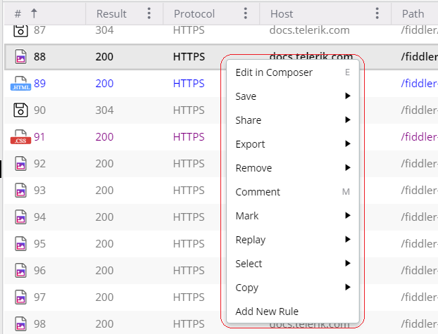
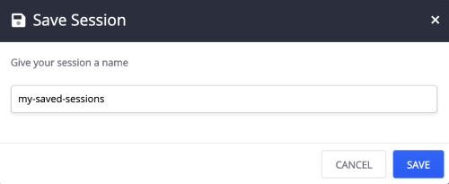
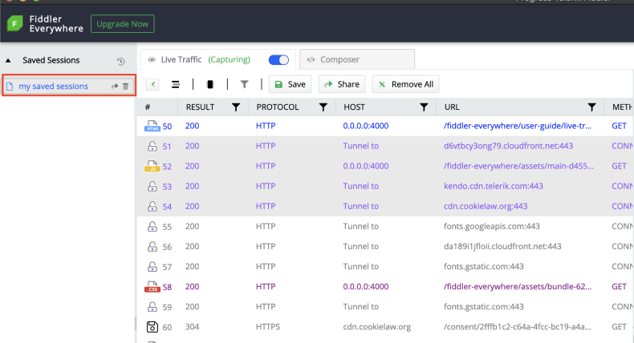

# Web Sessions List

## General

The Web Sessions list is the most important feature of Fiddler Everywhere - it displays a short sumary of each Session that Fiddler Everywhere has captured.

>tip A Web Session represents a single transaction between a client and a server, sometimes known as request/response pair. Each Session appears as a single entry in the Web Sessions List (refer to the images below). Each Session object has a Request and a Response, representing what the client sent to the server and what the server returned to the client. The Session object also maintains a set of Flags that record metadata about the Session, and a Timers object that stores timestamps logged in the course of processing the Session.

Many operations begin by selecting one or more entries in the Web Sessions list and then activating other features.
- To select more than one Sessions, hold the __Ctrl__ (__Command__ on Mac) or __Shift__ keys while clicking on the desired rows.
- Double-click or press __Enter__ (__Return__ on Mac) to activate the default inspectors for a single selected Session.

When the Inspectors are activated, they will automatically decide which Inspector is best suited to display the selected Session's request and response.

### Web Sessions List Columns

Certain key information is displayed in the columns of the Web Sessions list, including:

- __\#__ - An identification number generated by Fiddler Everywhere
- __Result__ - The status code from the response
- __Protocol__ - The protocol (HTTP/HTTPS/FTP) used by the Session
- __Host__ - The hostname and the port of the server to which the request was sent
- __URL__ - The URL path, file, and query string from the request
- __Method__ - The HTTP Method used by the request (GET, POST, etc,)
- __Body__ - The number of bytes in the responze body
- __Caching__ - Values from the Response's Expires and Cache-Control headers
- __Content-Type__ The Content-Type header from the response
- __Process__ The local OS process from which the traffic originated
- __Comments__ Field for showing the custom comments added by you (or the author of a shared session).

### Web Sessions Context Menu

The context menu for the Web Sessions list exposes a number of actions that can be applied for a Session or multiple Sessions.
- To invoke the context menu, press right click on Winows (__Control__ + mouse click on Mac).

## Save

The menu option __Save__ provides means to save selected sessions. The saved sessions will appear in the __Saved Sessions__ (the list to the left of Fiddler Everywhere interface) from where they can be re-opened later, exported and shared.

- Selected sessions - Saves all currently selected sessions.
- Unselected sessions - Saves all currently unselected sessions.
- All Sessions - All captured traffic will be saved.

ALl three options will prompt a save dialog.

The saved sessions are immediatly loaded in the __Saved Sessions__ list.

Double-click on the saved session to load it in the __Web Sessions__ list.

## Share
## Remove
## Comment
## Mark
## Replay
## Select
## Copy
## Add New Rule