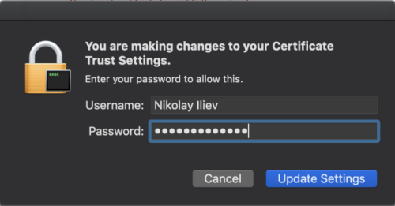
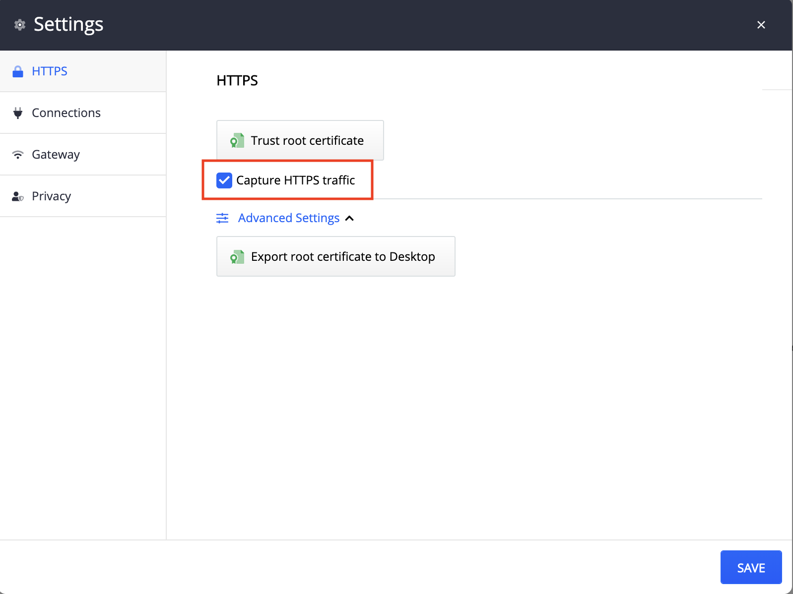

## Capturing Secure Traffic

After the initial startup, the Fiddler Everywhere application could only capture non-secure traffic (HTTP) while SSL traffic is not captured. To enable capturing and decrypting HTTPS traffic, you will need to explicitly install a root trust certificate via the __HTTPS__ submenu in __Settings__.

The submenu provides the following options:

- __Trust Root Certificate__ button.
    - __Capture HTTPS traffic__ checkbox (in-active by default).
- __Advanced Settings__ submenu.
    - __Export Root Certificate to Desktop and Trust Certificate__ button (Linux only).

    

## HTTPS Capturing for Windows

To enable HTTPS capturing & decoding on Windows or MacOS, use the __Trust Root Certificate__ option as follows:

1. Start Fiddler Everywhere on the device that will capture the traffic.
2. Go to __Settings > HTTPS__
3. Click the __Trust Root Certificate__ button. A trust certificate popup appears - confirm and add the certificate. 
A popup confirmation appears (__"Fiddler root certificate trusted successfully"__).
4. The __Capture HTTPS traffic__ checkbox is now active. Check the box to enable capturing HTTPS traffic.
5. Click the __Save__ button to save the changes.

## HTTPS Capturing for Mac OS

1. Start Fiddler Everywhere on the device that will capture the traffic.
2. Go to __Settings > HTTPS__
3. Click the __Trust Root Certificate__ button. A keychain user & password box appears. Enter your administrative credentials.
    

4. The __Capture HTTPS traffic__ checkbox is now active. Check the box to enable capturing HTTPS traffic.
    
    
5. Click the __Save__ button to save the changes.

## HTTPS Capturing for Linux

Some Linux distributions are using different security features and different ways of adding a root certificate. For such cases, the Fiddler Everywhere provides means to export the root trust certificate so that it could be manually imported in your Linux OS. Use the __Export Root Certificate to Desktop and Trust Certificate__ option as follows:

1. Start Fiddler Everywhere on the device that will capture the traffic.
2. Go to __Settings > HTTPS__
3. Expand the ___Advanced Settings__ submenu
3. Click the __Export Root Certificate to Desktop and Trust Certificate__ button. Enter your Keychain credentials in the popup window.
4. The __Capture HTTPS traffic__ checkbox is now active. Check the box to enable capturing HTTPS traffic.
5. Click the __Save__ button to save the changes.

>important Some Linux distributions like Ubuntu will use localized paths (for example, the __Desktop__ folder is renamed with the related word used in the locale language). That might cause for __step 3__ to fail due to a missing folder named __Desktop__ with an error message of type _Could not find a part of the path ..._. Until an out-of-the-box solution is implemented, you could easily workaround this issue by creating a folder called __Desktop__ at your root directory (`mkdir ~/Desktop`) and then export the certificate to the newly-created directory. Once the certificate is installed, you could safely remove the directory.

## See Also

* [How to install Fiddler root certificate on Windows]()
* [How to install Fiddler root certificate on Mac OS]()
* [How to install Fiddler root certificate in Firefox on Linux]()